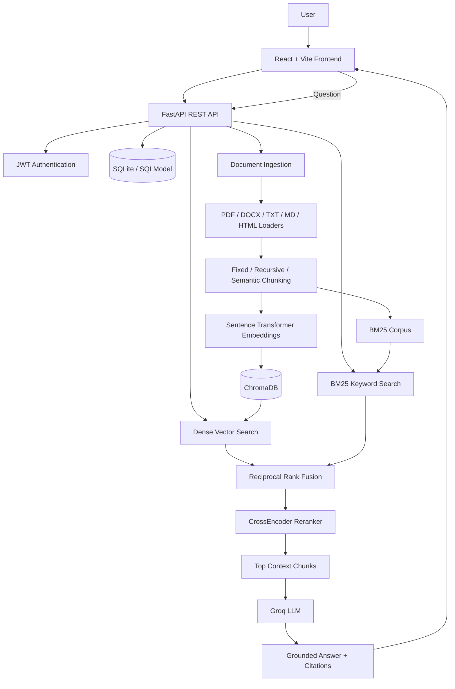

# HybridDocs AI

<p align="center">
  <strong>A full-stack, multi-user Retrieval-Augmented Generation platform with hybrid search, reranking, grounded answers, and inline citations.</strong>
</p>

<p align="center">
  <a href="#features">Features</a> •
  <a href="#architecture">Architecture</a> •
  <a href="#quick-start">Quick Start</a> •
  <a href="#api-endpoints">API</a> •
  <a href="#evaluation">Evaluation</a> •
  <a href="#deployment">Deployment</a>
</p>

<p align="center">
  
  
  
  
  
  
</p>

---

## Overview

**HybridDocs AI** allows users to upload private company or personal documents and ask questions about them through a web interface. The system retrieves relevant document passages using both semantic and keyword search, combines the results, reranks the strongest candidates, and asks a Groq-hosted language model to generate an answer grounded only in the retrieved context.

Every answer can include:

- inline source citations;
- source file and page metadata;
- confidence information;
- retrieved passage previews;
- dense-search, BM25, RRF, and reranker diagnostics.

This project demonstrates a production-oriented RAG workflow rather than a single-PDF chatbot.

## Features

### Document ingestion

- Upload PDF, DOCX, TXT, Markdown, HTML, and HTM files
- Extract and normalize text from multiple formats
- Preserve page and section metadata when available
- Validate file type and maximum upload size
- Detect duplicate documents with SHA-256 hashes
- Remove near-duplicate chunks before indexing
- Re-index documents with a different chunking strategy
- Delete documents and their associated vector records

### Chunking strategies

- **Fixed-size chunking** for a simple baseline
- **Recursive chunking** for paragraph- and section-aware splitting
- **Semantic chunking** for topic-boundary-based segmentation

### Hybrid retrieval

- Dense vector search with Sentence Transformers and ChromaDB
- Sparse keyword search with BM25
- Reciprocal Rank Fusion to combine retrieval rankings
- Optional CrossEncoder reranking
- Dense-only, BM25-only, and hybrid comparison modes
- Retrieval inspector for debugging ranking quality

### Grounded generation

- Groq chat-completion integration
- Context-only system prompt
- Inline numbered citations such as `[1]` and `[2]`
- Citation source cards with excerpts
- Confidence breakdown
- Graceful insufficient-context response
- Configurable retrieval and generation settings

### User experience

- User registration and login
- JWT-based authentication
- Per-user document and vector isolation
- Responsive React interface
- Document-management dashboard
- Conversation history
- Source and retrieval inspection

### Engineering and portfolio features

- FastAPI OpenAPI documentation
- SQLite and SQLModel persistence
- Starter golden question-answer dataset
- Automated evaluation script
- Backend unit tests
- Dockerfiles and Docker Compose
- GitHub Actions workflow
- Sample documents for demonstration

## Screenshots

Add project screenshots to a `screenshots/` directory and update the paths below.

### Landing page


### Document management


### Grounded answer with citations


### Retrieval inspector


> Until screenshots are added, GitHub will show broken image placeholders. Remove this section temporarily or add the four images before publishing.

## Architecture



## RAG workflow

1. A user uploads a supported document.
2. The backend extracts its text and metadata.
3. The selected chunking strategy divides the document into smaller passages.
4. Local Sentence Transformer embeddings are created for each chunk.
5. Dense vectors are stored in ChromaDB.
6. The same chunks remain available for BM25 keyword search.
7. A user submits a question.
8. The system performs dense and/or BM25 retrieval.
9. Reciprocal Rank Fusion combines both result lists.
10. The optional CrossEncoder reranks the strongest candidates.
11. The highest-ranked chunks are sent to Groq as numbered context blocks.
12. The model answers from that context and includes inline citations.
13. The frontend displays the answer, confidence, sources, and ranking details.

## Technology stack

| Layer | Technology |
|---|---|
| Frontend | React, Vite, Axios, React Router |
| Backend | Python, FastAPI, Uvicorn |
| Authentication | JWT, password hashing |
| Relational storage | SQLite, SQLModel |
| Dense retrieval | Sentence Transformers, ChromaDB |
| Sparse retrieval | `rank_bm25` |
| Fusion | Reciprocal Rank Fusion |
| Reranking | Sentence Transformers CrossEncoder |
| LLM provider | Groq |
| Document parsing | PyMuPDF, python-docx, Beautiful Soup |
| Testing | Pytest |
| Containers | Docker, Docker Compose |
| CI | GitHub Actions |

## Project structure

```text
hybrid-rag-platform/
├── backend/
│   ├── app/
│   │   ├── config.py
│   │   ├── database.py
│   │   ├── loaders.py
│   │   ├── main.py
│   │   ├── models.py
│   │   ├── rag.py
│   │   ├── schemas.py
│   │   └── security.py
│   ├── scripts/
│   │   ├── evaluate.py
│   │   └── seed_demo.py
│   ├── tests/
│   ├── uploads/
│   ├── .env.example
│   ├── Dockerfile
│   └── requirements.txt
├── frontend/
│   ├── src/
│   ├── .env.example
│   ├── Dockerfile
│   ├── package.json
│   └── vite.config.js
├── evaluation_dataset/
│   └── golden_qa.json
├── sample_documents/
├── screenshots/
├── .github/workflows/
├── docker-compose.yml
├── .gitignore
├── LICENSE
└── README.md
```

## Quick start

### Prerequisites

Install:

- Python 3.11 or newer
- Node.js 20 or newer
- Git
- A valid Groq API key

### 1. Clone the repository

```bash
git clone https://github.com/itswaleedtariq/hybrid-rag-platform.git
cd hybrid-rag-platform
```

If your repository uses a different name, replace the URL above.

### 2. Configure and run the backend

```bash
cd backend
python -m venv .venv
```

#### Windows PowerShell

```powershell
.\.venv\Scripts\Activate.ps1
```

If activation is blocked:

```powershell
Set-ExecutionPolicy -Scope Process -ExecutionPolicy Bypass
.\.venv\Scripts\Activate.ps1
```

#### macOS or Linux

```bash
source .venv/bin/activate
```

Install dependencies:

```bash
python -m pip install --upgrade pip
pip install -r requirements.txt
```

Create the environment file:

#### Windows PowerShell

```powershell
Copy-Item .env.example .env
```

#### macOS or Linux

```bash
cp .env.example .env
```

Add a new Groq key to `backend/.env`:

```env
GROQ_API_KEY=gsk_your_new_private_key
```

Do not commit `.env` or share the key publicly.

Start the backend:

```bash
uvicorn app.main:app --reload --port 8000
```

Open:

- API: `http://localhost:8000`
- Swagger documentation: `http://localhost:8000/docs`
- Health check: `http://localhost:8000/api/health`

### 3. Configure and run the frontend

Open a second terminal:

```bash
cd frontend
npm install
```

Create the frontend environment file:

#### Windows PowerShell

```powershell
Copy-Item .env.example .env
```

#### macOS or Linux

```bash
cp .env.example .env
```

Confirm it contains:

```env
VITE_API_URL=http://localhost:8000/api
```

Start the frontend:

```bash
npm run dev
```

Open:

```text
http://localhost:5173
```

## Environment variables

The backend reads settings from `backend/.env`.

```env
APP_NAME=HybridDocs AI
DEBUG=true

GROQ_API_KEY=
GROQ_MODEL=llama-3.3-70b-versatile
GROQ_MAX_TOKENS=1200

JWT_SECRET_KEY=replace-with-a-long-random-secret
ACCESS_TOKEN_EXPIRE_MINUTES=1440

DATABASE_URL=sqlite:///./data/rag_platform.db
CHROMA_PATH=./chroma_db
UPLOAD_PATH=./uploads
CORS_ORIGINS=http://localhost:5173,http://localhost:3000

MAX_UPLOAD_MB=20

EMBEDDING_MODEL=sentence-transformers/all-MiniLM-L6-v2
RERANKER_MODEL=cross-encoder/ms-marco-MiniLM-L-6-v2
ENABLE_RERANKER=true

CHUNK_SIZE=800
CHUNK_OVERLAP=120
SEMANTIC_BREAK_THRESHOLD=0.55

DENSE_WEIGHT=0.6
BM25_WEIGHT=0.4
RRF_K=60
RETRIEVAL_CANDIDATES=20
DEFAULT_TOP_K=5
MIN_RETRIEVAL_CONFIDENCE=0.30
```

### Low-memory mode

The reranker requires additional memory. Disable it when necessary:

```env
ENABLE_RERANKER=false
```

### Retrieval threshold tuning

When relevant chunks are retrieved but the application still returns insufficient context, test a lower threshold:

```env
MIN_RETRIEVAL_CONFIDENCE=0.15
```

Restart the backend after changing `.env`.

## Using the application

1. Create an account.
2. Open **Documents**.
3. Upload a supported file.
4. Select a chunking strategy.
5. Wait for the status to become `indexed`.
6. Open **Ask documents**.
7. Select `Hybrid`, `Dense only`, or `BM25 only`.
8. Ask a question that is answered by the uploaded documents.
9. Review the answer, citations, confidence, and retrieval inspector.

### Example questions

With the included sample documents:

```text
How many paid annual leave days do permanent employees receive?
```

```text
What does error AUTH-104 mean and what should I do first?
```

```text
What is the daily meal allowance for domestic travel?
```

```text
Compare the deadline for submitting expenses with the deadline for requesting annual leave.
```

## Seed the demo workspace

From the `backend` directory:

```bash
python -m scripts.seed_demo
```

Demo account:

```text
Email: demo@example.com
Password: DemoPassword123!
```

The seed script indexes the files in `sample_documents/`.

> The demo password is for local demonstration only. Do not use it for a public production account.

## API endpoints

### Authentication

| Method | Endpoint | Description |
|---|---|---|
| `POST` | `/api/auth/register` | Create an account |
| `POST` | `/api/auth/login` | Log in and receive a token |
| `GET` | `/api/auth/me` | Return the authenticated user |

### Documents

| Method | Endpoint | Description |
|---|---|---|
| `GET` | `/api/documents` | List the user's documents |
| `POST` | `/api/documents/upload` | Upload and index a document |
| `POST` | `/api/documents/{document_id}/reindex` | Re-index a document |
| `DELETE` | `/api/documents/{document_id}` | Delete a document and its chunks |

### Chat

| Method | Endpoint | Description |
|---|---|---|
| `POST` | `/api/chat/ask` | Ask a document-grounded question |
| `GET` | `/api/chat/conversations` | List conversations |
| `GET` | `/api/chat/conversations/{conversation_id}` | Read one conversation |
| `DELETE` | `/api/chat/conversations/{conversation_id}` | Delete a conversation |

### System

| Method | Endpoint | Description |
|---|---|---|
| `GET` | `/api/health` | Check service status |
| `GET` | `/api/stats` | Return workspace statistics |

## Example API request

```http
POST /api/chat/ask
Authorization: Bearer YOUR_JWT_TOKEN
Content-Type: application/json
```

```json
{
  "question": "What does AUTH-104 mean?",
  "conversation_id": null,
  "retrieval_mode": "hybrid",
  "top_k": 5
}
```

Example response shape:

```json
{
  "conversation_id": "conversation-id",
  "answer": "AUTH-104 means that the access token has expired or has an invalid signature [1].",
  "sources": [
    {
      "citation": 1,
      "filename": "engineering_runbook.txt",
      "page_number": null,
      "section_heading": null,
      "excerpt": "Error AUTH-104 means the access token is expired...",
      "verified": true
    }
  ],
  "confidence": {
    "retrieval": 0.82,
    "citation_coverage": 1.0,
    "citation_validity": 1.0,
    "composite": 0.91
  },
  "retrieval_mode": "hybrid",
  "insufficient_context": false,
  "retrieved_chunks": []
}
```

The values above illustrate the response format; they are not published benchmark results.

## Evaluation

A starter golden dataset is included at:

```text
evaluation_dataset/golden_qa.json
```

First seed the demo account and documents:

```bash
cd backend
python -m scripts.seed_demo
```

Then run:

```bash
python -m scripts.evaluate
```

The script writes:

```text
backend/evaluation_report.json
```

The current evaluator checks expected keywords and records confidence and cited files. For portfolio-quality evaluation, expand the dataset to at least 50 manually verified questions covering:

- direct lookups;
- exact technical terms;
- multi-document questions;
- ambiguous questions;
- questions with no answer in the corpus.

Recommended future metrics:

- retrieval recall@k;
- mean reciprocal rank;
- answer correctness;
- faithfulness;
- citation accuracy;
- unanswerable-question accuracy;
- average and percentile latency.

Do not publish accuracy claims until they are measured from an actual evaluation run.

## Testing

From the `backend` directory:

```bash
pytest -q
```

Tests cover core behaviors such as security, chunking, and retrieval utilities.

## Docker

Create a `.env` file in the project root:

```env
GROQ_API_KEY=gsk_your_new_private_key
JWT_SECRET_KEY=replace-with-a-long-random-secret
GROQ_MODEL=llama-3.3-70b-versatile
```

Run:

```bash
docker compose up --build
```

Open:

- Frontend: `http://localhost:3000`
- Backend: `http://localhost:8000`
- API documentation: `http://localhost:8000/docs`

Stop the services:

```bash
docker compose down
```

## Security

- API keys remain in backend environment variables.
- Passwords are hashed before storage.
- JWT tokens protect private endpoints.
- Queries and document operations are filtered by user ID.
- Uploaded filenames are sanitized.
- Upload type and file size are validated.
- Duplicate files are detected before indexing.
- `.env`, local databases, uploads, and vector data are excluded from Git.

Before each push, run:

```powershell
git check-ignore -v backend/.env
```

Search for accidentally committed Groq keys while excluding the environment file:

```powershell
Get-ChildItem -Recurse -File |
Where-Object {
    $_.FullName -notmatch '\\.venv\\' -and
    $_.Name -ne '.env'
} |
Select-String "gsk_"
```

The command should return no source-code matches.

## Deployment

### Current local architecture

- React frontend
- FastAPI backend
- SQLite database
- local ChromaDB persistence
- local uploaded files
- local embedding and reranking models
- Groq generation API

### Recommended public deployment architecture

| Component | Recommended service |
|---|---|
| Frontend | Vercel |
| Backend | Render, Railway, or a container host |
| Relational database | PostgreSQL |
| Vector database | Qdrant Cloud or server-backed Chroma |
| File storage | S3-compatible object storage |
| LLM | Groq |
| Background indexing | Celery, Dramatiq, or RQ |

For a multi-user public release, also add:

- database migrations;
- rate limiting;
- email verification;
- password reset;
- background document ingestion;
- virus scanning;
- OCR for scanned PDFs;
- structured logging and monitoring;
- request tracing;
- pagination;
- HTTPS-only deployment.

## Known limitations

- Scanned PDFs are not processed unless OCR is added.
- Local embedding and reranker models can consume significant RAM.
- SQLite and local ChromaDB are intended primarily for development and portfolio demonstrations.
- Document ingestion currently runs inside the web request.
- Citation verification is heuristic rather than a complete entailment system.
- Evaluation data is a starter set and should be expanded before reporting metrics.

## Roadmap

- [ ] Add OCR for scanned PDFs
- [ ] Move vector storage to Qdrant
- [ ] Replace SQLite with PostgreSQL
- [ ] Add background ingestion workers
- [ ] Add streaming answer generation
- [ ] Add document collections and workspaces
- [ ] Add administrator analytics
- [ ] Add feedback buttons for answer quality
- [ ] Add RAGAS or DeepEval evaluation
- [ ] Add prompt-injection detection
- [ ] Add cloud file storage
- [ ] Deploy a public demo

## GitHub setup

```bash
git init
git add .
git commit -m "Build hybrid RAG platform"
git branch -M main
git remote add origin https://github.com/itswaleedtariq/hybrid-rag-platform.git
git push -u origin main
```

Make sure `backend/.env` does not appear in `git status`.

## Contributing

Issues and pull requests are welcome.

1. Fork the repository.
2. Create a feature branch.
3. Make and test the change.
4. Open a pull request with a clear description.

## Author

**Waleed Tariq**

- GitHub: [itswaleedtariq](https://github.com/itswaleedtariq)
- LinkedIn: [Waleed Tariq](https://www.linkedin.com/in/waleed-tariq-80914a292)

## License

This project is licensed under the MIT License. See [LICENSE](LICENSE) for details.

---

<p align="center">
  Built as a production-oriented AI engineering portfolio project.
</p>
